# Harvest Operation 工业生产链规划（最终版）

> 这是工业制造系统的设计规划，不代表当前版本已经接入全部物品、配方或生产设备。厨房设备和厨房配方不纳入本文档。工业设施建议继续放在独立的工业设施目录中，不放入 `buildings` 文件夹。

## 状态说明

- `✅ 已有模型`：工程中已经存在可以直接使用的模型或场景，但不代表已经完成物品注册和配方接入。
- `◐ 可复用/参考`：工程中有相近模型，可以作为首版视觉资源或制作参考，但还没有最终独立模型。
- `⏳ 待制作模型`：当前工程没有合适的最终模型，需要后续制作。
- `🛒 购买`：不通过生产链制作，只能从商店或交易系统获得。

## 最终设计原则

1. 橡胶原料统一使用现有的“橡胶桶”，不再额外制作“生橡胶”原料模型；橡胶桶可以加工成“橡胶零件”，工程塑料颗粒仍直接消耗橡胶桶。
2. 所有动物的皮类掉落统一使用物品 ID `animal_hide`、显示名“动物皮”，不按具体动物拆分；取消“皮革”中间材料。
3. 南瓜胸甲和南瓜护腿由南瓜掉落直接获得，不进入工业制造链。
4. 植物纤维、棉线、棉布、钢板、金属连接件、工程塑料颗粒、电路板、硝石矿、电子引爆模块和硬盘都作为独立的工业材料或制品规划。
5. “高级电脑”是可放置的综合工业设施：可以查看农场信息和天气，也可以开发机器人程序、烧录硬盘程序，并参与电子引爆模块的生产；高级电脑只能购买。
6. “简陋的电脑”是可自制的粗糙笔记本，只提供农场信息和天气查看功能。
7. 所有机器人程序都记录在硬盘中。程序不再制作成多个独立模型，只制作一个硬盘模型，通过物品名称和数据区分不同程序。
8. 机器人工作台负责制造机器人、安装程序硬盘和拆卸程序硬盘。
9. “防护网”“车载信号增强模块”“冷却和散热系统”都作为新的载具工业制品规划。

## 总体流程图

```mermaid
flowchart LR
    classDef existing fill:#e7f6ea,stroke:#2f855a,color:#173b26,stroke-width:1px;
    classDef todo fill:#fff3d6,stroke:#b7791f,color:#5c3b00,stroke-width:1px;
    classDef ref fill:#e8eefc,stroke:#4a67a1,color:#1e315e,stroke-width:1px;
    classDef facility fill:#f1e7fb,stroke:#805ad5,color:#38205f,stroke-width:1px;
    classDef purchase fill:#e6f4f8,stroke:#2b8299,color:#173d48,stroke-width:1px;
    classDef branch fill:#f2f2f2,stroke:#777,color:#333,stroke-width:1px;

    subgraph RAW["原材料与资源"]
        iron_ore["铁矿石<br/>✅ 已有模型"]:::existing
        copper_ore["铜矿石<br/>✅ 已有模型"]:::existing
        coal_ore["煤矿石 / 煤炭燃料<br/>✅ 已有资源模型"]:::existing
        limestone_ore["石灰岩矿<br/>✅ 已有模型"]:::existing
        stone["石头<br/>✅ 已有模型"]:::existing
        logs["木头 / 原木<br/>✅ 已有模型"]:::existing
        cotton_crop["棉花<br/>✅ 已有植株与掉落模型"]:::existing
        plant_fiber["植物纤维<br/>✅ PlantFiberBundle.glb"]:::existing
        tobacco["烟草<br/>✅ 已有植株与掉落模型"]:::existing
        rubber_barrel["橡胶桶<br/>✅ 直接作为橡胶原料"]:::existing
        animal["动物皮<br/>✅ AnimalHide.glb"]:::existing
        pumpkin_drop["南瓜掉落<br/>✅ 已有模型"]:::existing
        saltpeter["硝石矿<br/>✅ 已有矿石与掉落模型"]:::existing
    end

    subgraph BASIC["基础加工与中间材料"]
        smelter["工业熔炼设备<br/>✅ 05_ProcessingStations有模型"]:::facility
        comprehensive_material["综合材料加工台<br/>✅ 05_ProcessingStations有模型"]:::facility
        electronic_assembly["电子装配台<br/>✅ 05_ProcessingStations有模型"]:::facility
        woodworking["木材加工设备<br/>✅ 05_ProcessingStations有模型"]:::facility
        iron_ingot["铁锭<br/>✅ FTF_Product_IronIngot_Drop.glb"]:::existing
        copper_ingot["铜锭<br/>✅ FTF_Product_CopperIngot_Drop.glb"]:::existing
        steel_ingot["钢锭<br/>✅ FTF_Product_SteelIngots.glb"]:::existing
        steel_plate["钢板<br/>✅ FTF_Product_SteelPlate_Drop.glb"]:::existing
        copper_wire["铜线<br/>✅ FTF_Product_CopperWireSpool.glb"]:::existing
        glass["玻璃板<br/>✅ FTF_Product_GlassPanes.glb"]:::existing
        lumber["木板<br/>✅ FTF_Product_LumberBoards.glb"]:::existing
        plastic_pellets["工程塑料颗粒<br/>✅ FTF_Product_EngineeringPlasticPellets_Drop.glb"]:::existing
        plant_cloth["植物纤维布<br/>✅ PlantFiberCloth.glb"]:::existing
        cotton_thread["棉线<br/>✅ FTF_Product_CottonThreadSpool_Drop.glb"]:::existing
        cotton_cloth["棉布<br/>✅ FTF_Product_CottonCloth_Drop.glb"]:::existing
        metal_connector["金属连接件<br/>✅ FTF_Product_MetalConnector_Drop.glb"]:::existing
        battery["电池组<br/>✅ FTF_Product_BatteryPack.glb"]:::existing
        bearing["轴承<br/>✅ FTF_Product_Bearing.glb"]:::existing
        gear["齿轮组<br/>✅ FTF_Product_GearSet.glb"]:::existing
        hydraulic["液压组件<br/>✅ FTF_Product_HydraulicComponent.glb"]:::existing
        motor["高性能电机<br/>✅ FTF_Advanced_HighPerformanceMotor.glb"]:::existing
        control_module["车辆控制模块<br/>✅ FTF_Advanced_VehicleControlModule.glb"]:::existing
        composite_panel["复合装甲板<br/>✅ FTF_Advanced_CompositeArmorPanel.glb"]:::existing
        rubber_parts["橡胶零件<br/>✅ FTF_Product_RubberParts.glb"]:::existing
    end

    iron_ore -->|"冶炼 + 煤炭燃料"| smelter
    coal_ore --> smelter
    smelter --> iron_ingot
    iron_ingot -->|"精炼"| steel_ingot
    steel_ingot -->|"轧制"| steel_plate
    copper_ore --> smelter
    smelter --> copper_ingot
    copper_ingot --> comprehensive_material
    comprehensive_material --> copper_wire
    limestone_ore --> smelter
    smelter --> glass
    logs --> woodworking
    woodworking --> lumber
    rubber_barrel -->|"作为橡胶原料"| comprehensive_material
    coal_ore --> comprehensive_material
    comprehensive_material --> plastic_pellets
    comprehensive_material -->|"橡胶桶加工"| rubber_parts
    cotton_crop --> comprehensive_material
    comprehensive_material --> cotton_thread
    cotton_thread --> cotton_cloth
    plant_fiber --> comprehensive_material
    comprehensive_material --> plant_cloth
    steel_plate --> comprehensive_material
    plastic_pellets --> electronic_assembly
    glass --> electronic_assembly
    electronic_assembly --> battery

    subgraph ELECTRONICS["电子、电脑与程序硬盘"]
        circuit_board["电路板<br/>✅ CircuitBoard.glb"]:::existing
        simple_laptop["简陋的电脑<br/>✅ 笔记本模型已接入"]:::existing
        advanced_desktop["高级电脑<br/>🛒 只能购买；✅ 台式机场景已接入"]:::purchase
        blank_hdd["空白硬盘<br/>✅ FTF_Product_SolidStateDrive_Drop.glb"]:::existing
        program_hdd["程序硬盘<br/>✅ 共用 SolidStateDrive 模型"]:::existing
        detonator["电子引爆模块<br/>✅ FTF_Tool_ElectronicDetonatorModule.glb"]:::existing
        farm_info["农场信息查看"]:::branch
        weather_info["天气预测查看"]:::branch
        program_dev["开发机器人程序"]:::branch
        burn_program["向硬盘烧录程序"]:::branch
    end

    copper_wire --> electronic_assembly
    glass --> electronic_assembly
    plastic_pellets --> electronic_assembly
    electronic_assembly --> circuit_board
    circuit_board --> simple_laptop
    battery --> simple_laptop
    glass --> simple_laptop
    plastic_pellets --> simple_laptop
    simple_laptop --> farm_info
    simple_laptop --> weather_info
    advanced_desktop -.->|"只能购买"| program_dev
    advanced_desktop -.->|"只能购买"| farm_info
    advanced_desktop -.->|"只能购买"| weather_info
    circuit_board --> blank_hdd
    steel_plate --> blank_hdd
    plastic_pellets --> blank_hdd
    copper_wire --> blank_hdd
    advanced_desktop --> burn_program
    blank_hdd --> burn_program
    burn_program --> program_hdd
    advanced_desktop -->|"集成电子装配功能"| detonator

    subgraph ARMOR["装备与防护"]
        fiber_armor["植物纤维胸甲 / 护腿<br/>✅ 现有装备模型"]:::existing
        cotton_armor["棉布胸甲 / 护腿<br/>✅ 现有装备模型"]:::existing
        wood_armor["木制胸甲 / 护腿<br/>✅ 现有装备模型"]:::existing
        plastic_armor["工程塑料胸甲 / 护腿<br/>✅ 现有装备模型"]:::existing
        pumpkin_armor["南瓜胸甲 / 护腿<br/>✅ 南瓜掉落直接获得"]:::existing
        bulletproof_vest["防弹背心<br/>◐ 可复用 PoliceVest / MilitaryVest"]:::ref
        animal_backpack["动物皮背包<br/>✅ BackpackBrown.tscn 可复用"]:::existing
        advanced_armor["高级防护装备<br/>◐ 复合装甲板可作参考"]:::ref
    end

    plant_cloth --> fiber_armor
    cotton_cloth --> cotton_armor
    lumber --> wood_armor
    plastic_pellets --> plastic_armor
    pumpkin_drop --> pumpkin_armor
    cotton_cloth --> bulletproof_vest
    steel_plate --> bulletproof_vest
    metal_connector --> bulletproof_vest
    animal --> animal_backpack
    cotton_thread --> animal_backpack
    composite_panel --> advanced_armor
    metal_connector --> advanced_armor
    cotton_cloth --> advanced_armor

    subgraph VEHICLE["载具工业制品"]
        harvest_reel["收割模块<br/>✅ HarvestReel.glb"]:::existing
        vehicle_gun["车载机枪<br/>✅ PlatformMachineGun.glb"]:::existing
        defense_net["金属防护网<br/>✅ FTF_Product_MetalDefenseNetPiece_Drop.glb"]:::existing
        nitro["氮气加速装置<br/>✅ VehicleNitroBoost.glb"]:::existing
        extended_seat["扩展座椅<br/>✅ PlatformSeat.glb"]:::existing
        roof_light["车顶大灯<br/>✅ RoofHeadlights.glb"]:::existing
        signal_amp["车载信号增强模块<br/>✅ FTF_Tool_VehicleSignalAugment_Black_1_9m.glb"]:::existing
        cooling["冷却和散热系统<br/>✅ FTF_Tool_VehicleRoofCoolingSystem_White_2_3m.glb"]:::existing
        vehicle_repair["车辆维修相关组件"]:::branch
    end

    steel_plate --> harvest_reel
    gear --> harvest_reel
    hydraulic --> harvest_reel
    motor --> harvest_reel
    steel_plate --> vehicle_gun
    control_module --> vehicle_gun
    circuit_board --> vehicle_gun
    steel_plate --> defense_net
    metal_connector --> defense_net
    steel_plate --> nitro
    battery --> nitro
    rubber_parts --> nitro
    control_module --> nitro
    lumber --> extended_seat
    cotton_cloth --> extended_seat
    steel_plate --> extended_seat
    metal_connector --> extended_seat
    glass --> roof_light
    battery --> roof_light
    circuit_board --> roof_light
    metal_connector --> roof_light
    copper_wire --> signal_amp
    circuit_board --> signal_amp
    battery --> signal_amp
    plastic_pellets --> signal_amp
    steel_plate --> cooling
    motor --> cooling
    rubber_parts --> cooling
    metal_connector --> cooling
    rubber_parts --> vehicle_repair
    hydraulic --> vehicle_repair

    subgraph EXPLOSIVES["爆破制品"]
        explosive["炸药<br/>⏳ 模型待制作；RemoteBomb.glb 可作视觉参考"]:::todo
    end

    battery --> detonator
    circuit_board --> detonator
    copper_wire --> detonator
    metal_connector --> detonator
    saltpeter --> explosive
    plastic_pellets --> explosive
    steel_plate --> explosive
    detonator --> explosive

    subgraph ROBOTS["机器人与程序"]
        robot_workbench["机器人工作台<br/>⏳ 设施模型待制作"]:::facility
        robot_body["机器人结构件 / 机体<br/>⏳ 模型待制作"]:::todo
        combat_robot["战斗机器人<br/>⏳ 四足或人形模型待制作"]:::todo
        suicide_robot["自爆机器人<br/>⏳ 四足或人形模型待制作"]:::todo
        defense_robot["防御机器人<br/>⏳ 四足或人形模型待制作"]:::todo
        cargo_robot["货运机器人<br/>⏳ 四足或人形模型待制作"]:::todo
        combat_program["战斗程序 I / II<br/>存储在程序硬盘"]:::branch
        defense_program["防御程序 I / II / III<br/>存储在程序硬盘"]:::branch
        suicide_program["自爆程序 I / II<br/>存储在程序硬盘"]:::branch
        cargo_program["货运程序 I / II / III / IV<br/>存储在程序硬盘"]:::branch
    end

    steel_plate --> robot_body
    gear --> robot_body
    hydraulic --> robot_body
    motor --> robot_body
    battery --> robot_body
    circuit_board --> robot_body
    plastic_pellets --> robot_body
    robot_body --> robot_workbench
    program_hdd --> robot_workbench
    circuit_board --> robot_workbench
    robot_workbench --> combat_robot
    robot_workbench --> suicide_robot
    robot_workbench --> defense_robot
    robot_workbench --> cargo_robot
    program_hdd --> combat_program
    program_hdd --> defense_program
    program_hdd --> suicide_program
    program_hdd --> cargo_program
    combat_program --> combat_robot
    defense_program --> defense_robot
    suicide_program --> suicide_robot
    cargo_program --> cargo_robot
    explosive --> suicide_robot

    subgraph OTHER["暂不纳入核心工业链的资源"]
        tobacco_use["烟草：暂保留为农业 / 消耗品链<br/>后续另行规划"]:::branch
        stone_use["石头：用于建筑、道路或基础设施<br/>不作为本版高阶工业材料"]:::branch
    end
    tobacco --> tobacco_use
    stone --> stone_use
```



## 生产设备分工

| 设备 | 主要产出 | 模型状态 |
|---|---|---|
| 工业熔炼设备 | 铁锭、铜锭、钢锭、钢板、玻璃板 | ✅ 05_ProcessingStations 有 `FTF_Industrial_Furnace.glb`；场景/碰撞待接入 |
| 木材加工设备 | 木板、木制装备 | ✅ 05_ProcessingStations 有 `FTF_Tool_WoodProcessingTable_VerticalCircularSaw.glb`；场景/碰撞待接入 |
| 综合材料加工台 | 植物纤维布、棉线、棉布、工程塑料颗粒、橡胶零件、铜线、金属连接件、金属防护网、护甲 | ✅ 05_ProcessingStations 有 `FTF_Tool_ComprehensiveMaterialProcessingStation.glb`；场景/碰撞待接入 |
| 电子装配台 | 电路板、电池组、电子引爆模块、硬盘、载具信号增强模块、载具冷却系统、车载机枪、氮气加速装置、车顶大灯、笔记本电脑 | ✅ 05_ProcessingStations 有 `FTF_Tool_ElectronicAssemblyStation.glb`；场景/碰撞待接入 |
| 简陋的电脑 | 农场信息、天气预测 | ✅ 笔记本场景已接入；电脑 UI 待开发 |
| 高级电脑 | 农场信息、天气预测、程序开发、硬盘烧录 | 🛒 只能购买；台式机场景已接入 |
| 机器人工作台 | 制造机器人、安装和拆卸程序硬盘 | ⏳ 待制作 |
| 工业装配设备 | 载具模块、炸药、复杂工业制品 | ⏳ 待制作 |

厨房设备不使用上述工业设备分类，继续单独归入厨房系统。

当前在 `FoodWar_TodaysModels_20260824/05_ProcessingStations` 中确认到的操作台模型有：工业熔炼设备、综合材料加工台、电子装配台、机器人装配舱、木材加工台，共 5 个。纤维、塑料、护甲统一复用综合材料加工台；冷却系统和其他电子模块使用电子装配台；机器人装配舱本轮只保留模型记录，不实现机器人程序或机器人测试。

## 配方方案（本轮修订）

> 本表是当前工业制造方案，制作系统尚未在本轮接入。`kg` 表示散装物料重量，`份` 表示一个完整的物品或组件；同一格中的材料均需要同时投入。橡胶桶可以直接加工工程塑料颗粒，也可以先加工为橡胶零件；液压组件、载具冷却系统和氮气加速装置使用橡胶零件，不使用橡胶桶。

### 基础材料与机械部件

| 输入材料（数量） | 操作台 | 输出（数量） |
|---|---|---|
| 铁矿 2 kg；煤矿 1 kg | 工业熔炼设备 | 铁锭 1 kg |
| 铜矿 2 kg；煤矿 1 kg | 工业熔炼设备 | 铜锭 1 kg |
| 铁锭 2 kg；煤矿 1 kg | 工业熔炼设备 | 钢锭 1 kg |
| 钢锭 2 kg | 工业熔炼设备 | 钢板 1 kg |
| 石灰石 2 kg；煤矿 1 kg | 工业熔炼设备 | 玻璃板 1 kg |
| 原木 1 份（2 kg） | 木材加工设备 | 木板 2 kg |
| 植物纤维 3 kg | 综合材料加工台 | 植物纤维布 1 kg |
| 棉花 2 kg | 综合材料加工台 | 棉线 1 kg |
| 棉线 2 kg | 综合材料加工台 | 棉布 1 kg |
| 橡胶桶 1 份；煤矿 1 kg | 综合材料加工台 | 工程塑料颗粒 2 kg |
| 橡胶桶 1 份 | 综合材料加工台 | 橡胶零件 2 份 |
| 铜锭 1 kg | 综合材料加工台 | 铜线 1 kg |
| 钢板 1 kg；铁锭 1 kg | 综合材料加工台 | 金属连接件 2 份 |
| 钢锭 1 kg；金属连接件 1 份 | 综合材料加工台 | 轴承 2 份 |
| 钢锭 2 kg；轴承 1 份 | 综合材料加工台 | 齿轮组 1 份 |
| 钢板 1 kg；金属连接件 1 份；橡胶零件 1 份 | 综合材料加工台 | 液压组件 1 份 |
| 钢板 2 kg；金属连接件 2 份 | 综合材料加工台 | 金属防护网 1 份 |
| 钢板 2 kg；工程塑料颗粒 2 kg；金属防护网 1 份 | 综合材料加工台 | 复合装甲板 1 份 |

### 电子、电脑与载具模块

| 输入材料（数量） | 操作台 | 输出（数量） |
|---|---|---|
| 铜线 1 kg；玻璃板 1 kg；工程塑料颗粒 1 kg | 电子装配台 | 电路板 1 份 |
| 电路板 1 份；铜线 1 kg；工程塑料颗粒 1 kg | 电子装配台 | 电池组 1 份 |
| 电路板 1 份；钢板 1 kg；工程塑料颗粒 1 kg；金属连接件 1 份 | 电子装配台 | 空白硬盘 1 份 |
| 铜线 1 kg；齿轮组 1 份；电池组 1 份；钢板 1 kg | 电子装配台 | 高性能电机 1 份 |
| 电路板 1 份；电池组 1 份；铜线 1 kg；金属连接件 1 份 | 电子装配台 | 车辆控制模块 1 份 |
| 电路板 1 份；铜线 1 kg；金属连接件 1 份；硝矿石 1 kg | 电子装配台 | 电子引爆模块 1 份 |
| 电路板 1 份；电池组 1 份；铜线 1 kg；工程塑料颗粒 1 kg | 电子装配台 | 车载信号增强模块 1 份 |
| 钢板 1 kg；橡胶零件 1 份；金属连接件 1 份；高性能电机 1 份 | 电子装配台 | 载具冷却系统 1 份 |
| 钢板 2 kg；齿轮组 1 份；液压组件 1 份；高性能电机 1 份 | 综合材料加工台 | 收割模块 1 份 |
| 钢板 2 kg；车辆控制模块 1 份；电路板 1 份 | 电子装配台 | 车载机枪 1 份 |
| 钢板 1 kg；电池组 1 份；橡胶零件 1 份；车辆控制模块 1 份 | 电子装配台 | 氮气加速装置 1 份 |
| 木板 1 kg；棉布 1 kg；钢板 1 kg；金属连接件 1 份 | 综合材料加工台 | 扩展座椅 1 份 |
| 玻璃板 1 kg；电池组 1 份；电路板 1 份；金属连接件 1 份 | 电子装配台 | 车顶大灯 1 份 |
| 电路板 1 份；电池组 1 份；空白硬盘 1 份；工程塑料颗粒 1 kg；金属连接件 1 份 | 电子装配台 | 笔记本电脑 1 份 |
| 无 | 无 | 高端台式机：只能购买，不可生产 |

收割模块、车载机枪、氮气加速装置、扩展座椅、车顶大灯、车载信号增强模块和载具冷却系统制作完成后，均必须交由载具店安装，玩家不能直接安装。工程塑料颗粒直接使用橡胶桶，不经过橡胶零件。

### 护甲与背包

| 输入材料（数量） | 操作台 | 输出（数量） |
|---|---|---|
| 植物纤维布 3 kg | 综合材料加工台 | 植物纤维胸甲 1 件 |
| 植物纤维布 2 kg | 综合材料加工台 | 植物纤维护腿 1 件 |
| 棉布 3 kg | 综合材料加工台 | 棉布胸甲 1 件 |
| 棉布 2 kg | 综合材料加工台 | 棉布护腿 1 件 |
| 木板 3 kg | 木材加工设备 | 木质胸甲 1 件 |
| 木板 2 kg | 木材加工设备 | 木质护腿 1 件 |
| 工程塑料颗粒 4 kg | 综合材料加工台 | 工程塑料胸甲 1 件 |
| 工程塑料颗粒 3 kg | 综合材料加工台 | 工程塑料护腿 1 件 |
| 棉布 2 kg；钢板 1 kg；金属连接件 2 份 | 综合材料加工台 | 防弹背心 1 件 |
| 棉布 3 kg；钢板 2 kg；金属防护网 1 份；金属连接件 2 份 | 综合材料加工台 | 军用防弹背心 1 件 |
| 南瓜 1 份 | 无（农作物掉落） | 南瓜胸甲 1 件 |
| 南瓜 1 份 | 无（农作物掉落） | 南瓜护腿 1 件 |
| 动物皮 3 kg；棉线 2 kg；金属连接件 1 份 | 综合材料加工台 | 动物皮背包 1 件 |
| 棉布 10 kg | 综合材料加工台 | 棉布背包 1 件 |
| 棉布 10 kg；金属防护网 1 份；金属连接件 2 份 | 综合材料加工台 | 军用背包 1 件 |

以上护甲方案中，植物纤维胸甲/护腿、棉布胸甲/护腿、木质胸甲/护腿以及棉布背包均不消耗金属连接件；棉布背包和军用背包的棉布用量统一为 10 kg。

## 主要模型清单

### 已有模型，可直接作为首版资源

- 橡胶桶：`res://assets/other_items/Material/FTF_Resource_RawRubber_Barrel_Drop.glb`
- 铁矿石、铜矿石、煤矿石、石灰岩矿、石头：已有资源节点和掉落模型。
- 原木：`res://assets/other_items/Material/Log_Drop.glb`、`Log_Scene.glb`
- 动物皮：`res://assets/other_items/Material/AnimalHide.glb`
- 植物纤维：`res://assets/other_items/Material/PlantFiberBundle.glb`
- 植物纤维布：`res://assets/other_items/industrials/PlantFiberCloth.glb`
- 铁锭：`res://assets/other_items/industrials/FTF_Product_IronIngot_Drop.glb`
- 铜锭：`res://assets/other_items/industrials/FTF_Product_CopperIngot_Drop.glb`
- 钢板：`res://assets/other_items/industrials/FTF_Product_SteelPlate_Drop.glb`
- 金属连接件：`res://assets/other_items/industrials/FTF_Product_MetalConnector_Drop.glb`
- 棉线：`res://assets/other_items/industrials/FTF_Product_CottonThreadSpool_Drop.glb`
- 棉布：`res://assets/other_items/industrials/FTF_Product_CottonCloth_Drop.glb`
- 工程塑料颗粒：`res://assets/other_items/industrials/FTF_Product_EngineeringPlasticPellets_Drop.glb`
- 橡胶零件：`res://assets/other_items/industrials/FTF_Product_RubberParts.glb`
- 硬盘：`res://assets/other_items/industrials/FTF_Product_SolidStateDrive_Drop.glb`
- 金属防护网：`res://assets/other_items/industrials/FTF_Product_MetalDefenseNetPiece_Drop.glb`
- 电子引爆模块：`res://assets/other_items/industrials/FTF_Tool_ElectronicDetonatorModule.glb`
- 载具冷却系统：`res://assets/vehicles/FTF_Tool_VehicleRoofCoolingSystem_White_2_3m.glb`
- 车载信号增强模块：`res://assets/vehicles/FTF_Tool_VehicleSignalAugment_Black_1_9m.glb`
- 棉花、烟草：已有植株和采集掉落模型。
- 硝石矿：`res://assets/nature/drop_items/drop_saltpeter_ore.glb`，矿石节点使用对应的 Material 模型。
- 钢锭：`res://assets/other_items/industrials/FTF_Product_SteelIngots.glb`
- 木板：`res://assets/other_items/industrials/FTF_Product_LumberBoards.glb`
- 铜线：`res://assets/other_items/industrials/FTF_Product_CopperWireSpool.glb`
- 玻璃板：`res://assets/other_items/industrials/FTF_Product_GlassPanes.glb`
- 简陋的电脑：`res://assets/facilities/interior/FTF_Prop_OldLaptop_GrayWhite.glb`
- 电池组、轴承、齿轮组、液压组件：已有工业产品模型。
- 复合装甲板、高性能电机、车辆控制模块：已有高级工业产品模型。
- 电路板：`res://assets/other_items/industrials/CircuitBoard.glb`，已从 `assets` 根目录移动并注册为背包物品。
- 载具模块：收割模块 `res://assets/vehicles/HarvestReel.glb`、车载机枪 `res://assets/vehicles/PlatformMachineGun.glb`、氮气加速装置 `res://assets/vehicles/VehicleNitroBoost.glb`、扩展座椅 `res://assets/vehicles/PlatformSeat.glb`、车顶大灯 `res://assets/vehicles/RoofHeadlights.glb` 均已有模型或场景。
- 植物纤维、棉花、木制、工程塑料、南瓜胸甲和护腿：已有装备场景。
- 动物皮背包：`res://character/equipments/BackpackBrown.tscn` 可复用。

### 仍需要制作最终模型

- 木质钓鱼竿、金属钓鱼竿。
- 炸药：`RemoteBomb.glb` 可以作为首版视觉参考，独立炸药物品仍建议制作专用模型。
- 机器人工作台、机器人结构件，以及战斗、自爆、防御、货运四类机器人模型。

## 硬盘与程序数据规则

硬盘是唯一的程序载体，不为“战斗程序 I”“货运程序 IV”等分别制作模型。建议在物品数据中使用以下字段区分：

```text
storage_type: hard_drive
program_id: combat_1 / cargo_4 / defense_2 / suicide_1
program_family: combat / cargo / defense / suicide
program_tier: 1 / 2 / 3 / 4
compatible_robot_type: combat / cargo / defense / suicide
is_blank: true / false
```

推荐的游戏内物品显示方式：

- `硬盘（空白）`
- `硬盘（战斗程序 I）`
- `硬盘（战斗程序 II）`
- `硬盘（防御程序 I）`
- `硬盘（货运程序 IV）`
- `硬盘（自爆程序 I）`

这样可以保持模型、背包图标和资源管理简单，同时让程序等级、适配机器人类型和烧录状态完全由数据控制。

## 尚未进入本版核心链的内容

- 烟草暂时不强行转化为工业材料，保留为农业或消耗品链的原料，后续再决定是否制作烟草提取物、驱虫用品等产品。
- 石头暂时作为建筑、道路和基础设施材料，不作为载具和机器人高阶工业链的核心材料。
- 不增加“皮革”“防弹纤维布”“爆破核心”“工业爆破装药”等中间材料。
- 高级电脑只购买，不使用简陋电脑升级得到。
- 程序模块不制作独立 3D 模型，全部由硬盘承载。
